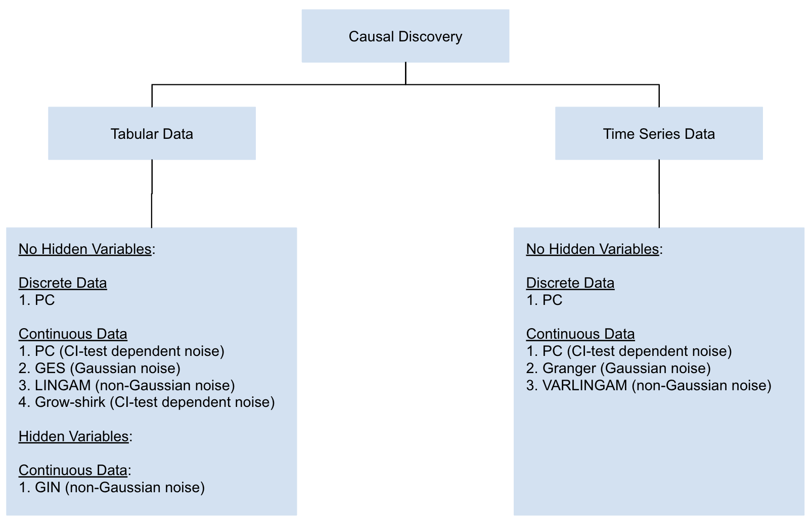
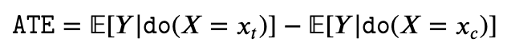
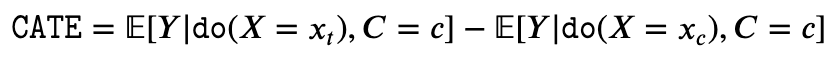
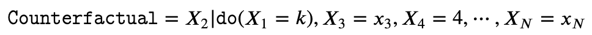

# Salesforce CausalAI Library

:fire::fire:**Updates**:fire::fire:

- Added GES, LINGAM, GIN for tabular data causal discovery
- Added markov blanket discovery algorithm (grow-shrink) for tabular data
- Added benchmarking modules for tabular and time series data, that will help the research community benchmark new and existing causal discovery algorithms against various challenges in the data (graph sparsity, sample complexity, variable complexity, SNR, noise type, etc)
- Root cause analysis

## Table of Contents
1. [Introduction](#introduction)
1. [Installation](#installation)
1. [Quick Tutorial](#quick-tutorial)
1. [User Inferface](#user-inferface)
1. [Documentation](#documentation)
1. [Technical Report and Citing Salesforce CausalAI](#technical-report-and-citing-salesforce-causalai)

## Introduction

Salesforce CausalAI is an open-source Python library for causal analysis using observational data. It supports causal discovery and causal inference for tabular and time series data, of both discrete and continuous types. It also supports Markov Blanket discovery algorithms. This library includes algorithms that handle linear and non-linear causal relationship between variables, and uses multi-processing for speed-up. We also include a data generator capable of generating synthetic data with specified structural equation model for both the aforementioned data formats and types, that helps users control the ground-truth causal process while investigating various algorithms. CausalAI includes benchmarking modules for tabular and time series data, that users can use to compare different causal discovery algorithms, as well as evaluate the performance of a particular algorithm across datasets with different challenges. Specifically, users can evaluate the performance of causal discovery algorithms on synthetic data with varying graph sparsity, sample complexity, variable complexity, SNR, noise type, and max lag (time series data). Finally, we provide a user interface (UI) that allows users to perform causal analysis on data without coding. The goal of this library is to provide a fast and flexible solution for a variety of problems in the domain of causality.

Some of the key features of CausalAI are:

- Algorithms: Support for causal discovery, causal inference, Markov blanket discovery, and Root Cause Analysis (RCA).
- Data: Causal analysis on tabular and time series data, of both discrete and continuous types.
- Missing Values: Support for handling missing/NaN values in data.
- Data Generator: A synthetic data generator that uses a specified structural equation model (SEM) for generating tabular and time series data. This can be used for evaluating and comparing different causal discovery algorithms since the ground truth values are known.
- Distributed Computing: Use of multi-processing using the [Python Ray library](https://docs.ray.io/en/latest/), that can be optionally turned on by the user when dealing with large datasets or number of variables for faster compute.
- Targeted Causal Discovery: In certain cases, we support targeted causal discovery, in which the user is only interested in discovering the causal parents of a specific variable of interest instead of the entire causal graph. This option reduces computational overhead.
- Visualization: Visualize tabular and time series causal graphs.
- Prior Knowledge: Incorporate any user provided partial prior knowledge about the causal graph in the causal discovery process.
- Benchmarking: Benchmarking module for comparing different causal discovery algorithms, as well as evaluating the performance of a particular algorithm across datasets with different challenges.
- Code-free UI: Provide a code-free user interface in which users may directly upload their data and perform their desired choice of causal analysis algorithm at the click of a button.


### Causal Discovery

We support the following causal discovery algorithm categorized by their assumptions on whether hidden variables are allowed, whether the data is discrete or contiuous, and the type of noise in the data.



For continuous data, PC algorithm, IAMB, and Grow-shrink support both linear and non-linear causal relationships depending on the CI test used. All other algorithms support linear relationships.

### Causal Inference

We support the following causal inference estimations for tabular and time series data of continuous and discrete types:
  - **Average Treatment Effect (ATE)**: ATE aims to determine the relative expected difference in the value of Y when we intervene X to be x_t compared to when we intervene X to be x_c. Here x_t and x_c are respectively the treatment value and control value.


  - **Conditional Average Treatment Effect (CATE)**: CATE is similar to ATE, except that in addition to intervetion on X, we also condition on some set of variables C taking value c. Notice here that X is intervened but C is not. 


  - **Counterfactual**: Counterfactuals aim at estimating the effect of an intervention on a specific instance or sample. Suppose we have a specific instance of a system of random variables (X_1, X_2,...,X_N) given by (X_1=x_1, X_2=x_2,...,X_N=x_N), then in a counterfactual, we want to know the effect an intervention (say) X_1=k would have had on some other variable(s) (say X_2), holding all the remaining variables fixed.


Depending on whether the relationship between variables is linear or non-linear, the user may specify a linear or non-linear prediction model respectively in the inference module.

## Installation

Prior to installing the library, create a conda environment with Python 3.9 or a later version. This can be done by executing ``conda create -n causal_ai_env python=3.9``. Activate this environment by executing ``conda activate causal_ai_env``. To install Salesforce CausalAI, git clone the library, go to the root directory of the repository, and execute ``pip install .``. 

Before importing and calling the library, or launching the UI, remember to first activate the conda environemnt.

## Quick Tutorial

Let's suppose we have some data 

## User Inferface

We provide a UI for users to directly upload their data and run causal discovery and causal inference algorithms without the need to write any code. An introduction to the UI can be found [here](https://opensource.salesforce.com/causalai/latest/ui_tutorial.html) and a video showing how to use the UI can be found [here](https://www.salesforceairesearch.com/projects/CausalAI).


In order to launch the UI, go to the root directory of the library and execute ``./launch_ui.sh``, and open the url specified in the terminal in a browser. In order to terminate the UI, press Ctrl+c in the terminal where the UI was launched, and then execute ``./exit_ui.sh``.

## Documentation

For Jupyter notebooks with exmaples, see
[`tutorials`](https://github.com/salesforce/causalai/tree/main/tutorials). Detailed API documentation with tutorials can be found [here](https://opensource.salesforce.com/causalai). The
[technical report](https://arxiv.org/abs/2301.10859) describes the implementation details of the algorithms along with their assumptions and also covers important aspects of the API. Further, it also presents experimental results that demosntrate the speed and performance our library compared with some of the existing libraries.

## Technical Report and Citing Salesforce CausalAI
You can find more details in our [technical report](https://arxiv.org/abs/2301.10859)

If you're using Salesforce CausalAI in your research or applications, please cite using this BibTeX:
```
@article{salesforce_causalai23,
      title={Salesforce CausalAI Library: A Fast and Scalable framework for Causal Analysis of Time Series and Tabular Data},
      author={Arpit, Devansh and Fernandez, Matthew, Liu, Chenghao and Yao, Weiran and Yang, Wenzhuo and Josel, Paul and Heinecke, Shelby and Hu, Eric and Wang, Huan and Hoi, Stephen and Xiong, Caiming and Zhang, Kun and Niebles, Juan Carlos},
      year={2023},
      eprint={arXiv preprint arXiv:2301.10859},
      archivePrefix={arXiv},
      primaryClass={cs.LG}
}
```